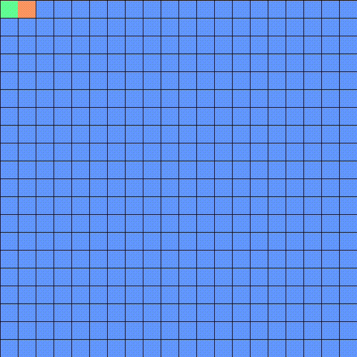

# Wavefront_Algorithm
O algoritmo "wavefront" simula a propagação de onda pelo ambiente com o objetivo de encontrar o melhor caminho até um local expecífico.

-> Algoritmo usado para construir o labirinto: Recursive implementation

-> Bibliotecas utilizadas: pygame, random, numpy
